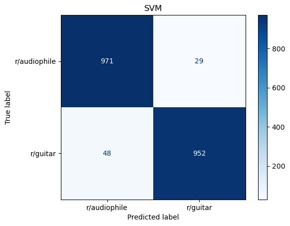
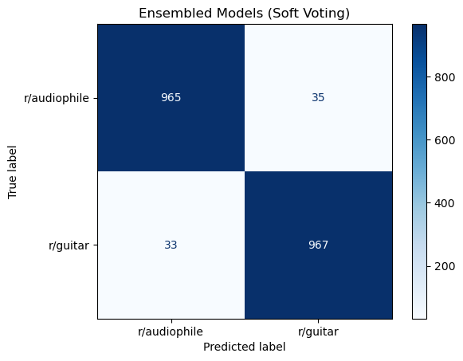

    

<h1 style="text-align:center">
Reddit Classification With Natural Language Processing And Machine Learning
</h1>

##### Contents:
- [Problem Statement](#problem-statement)
- [Background](#background)
- [Datasets](#datasets)
- [Data Collection](#data-collection)
- [Data Cleaning](#data-cleaning)
- [Preprocessing](#preprocessing)
- [Exploratory Data Analysis (EDA)](#exploratory-data-analysis)
- [Modeling](#modeling)
- [Conclusions](#conclusions)
- [Recommendations](#recommendations)

## Problem Statement
Reddit has hired my team of data scientists to prototype a machine learning model that utilizes Natural Language Processing (NLP) to determine which subreddit a post originated from, only provided its content (i.e. no title, no comments, no metadata). This model will be a binary classification model for two specific subreddits using a bag-of-words approach.
Reddit has determined 2 requirements for our team to measure success:
1. Accuracy of classification > 95%
2. Both Precision and Recall must remain > 90%

## Background
Identifying the subreddit origin of a random post on Reddit is a challenging task that requires an in-depth understanding of the language, style, and content of different subreddits. In a world where misinformation and disinformation are prevalent, being able to accurately classify posts to their original source can significantly impact the credibility and reliability of the information being shared.

Reddit has hired my team of data scientists to prototype a machine learning model that utilizes NLP to determine which subreddit a post comes from only given its content (i.e. no title, no comments, no metadata). This is desirable because this concept can be expanded to other inputs and data generated by Reddit users that can be utilized in moderation, targeted marketing, and trend analysis.

Because this is a proof-of-concept model that my team is building, we have confirmed with Reddit that we will build a model that will be trained for binary classification on two specific subreddits that have content related to one another. The principle for limiting the scope to this degree is to prove that the concept is functional with a small set of data before allocating significant financial resources to build a generalized model for the entire website. It is critical that the subreddit topics be related to prove that this method can function even when subreddit posts may appear similar. Provided the proof-of-concept model is successful, Reddit will then focus more resources on improving the model and generalizing it to the entire website.

As mentioned in the problem statement, Reddit's metrics for success are achieving an accuracy that exceeds 95% whilst also maintaining precision and recall above 90%. The purpose of these numbers is that Reddit wants to ensure that the model is accurate and has a balanced performance.

To achieve these targets, our team will use a bag-of-words approach. We will use a common API to scrape the text of posts on the chosen subreddits and then test multiple methods of pre-processing. We will test multiple different models as well as look at ensembling the best ones.

This repository contains the code in the form of a scientific notebook report, the data, and the models that were used.

---

## Datasets
Data sets were collected from two subreddits on [Reddit.com](https://reddit.com) by scraping the data using the [Pushshift API](https://github.com/pushshift/api). The two subreddits that were selected were [*r/audiophile*](https://www.reddit.com/r/audiophile) and [*r/guitar*](https://www.reddit.com/r/guitar) because they have a sufficient amount of data as well as being related in topic.

### Data Dictionary
The data dictionary contains all features, provided and engineered, that were used in the models.

|Feature|Type|Dataset|Description|
|---|---|---|---|
|**subreddit**|*str*|Reddit|The name of the subreddit a post was scraped from|
|**created_utc**|*str*|Reddit|The epoch timestamp of when the post was created|
|**post_length**|*int*|Reddit|The length of each post by character|
|**post_word_count**|*int*|Reddit|The length of each post by word count|
|**selftext**|*str*|Reddit|The text from a post on a subreddit|
|**cleaned_selftext**|*str*|Reddit|The cleaned text from a post on a subreddit (used for testing, but not in final model)|
|**no_stop_selftext**|*str*|Reddit|The cleaned text from a post on a subreddit with stopwords removed (used for testing, but not in final model)|
|**stem_selftext**|*str*|Reddit|The cleaned and stemmed text from a post on a subreddit with stopwords removed (used for testing, but not in final model)|
|**lemmatize_selftext**|*str*|Reddit|The cleaned and lemmatized text from a post on a subreddit with stopwords removed (used for testing, but not in final model)|
|**no_shared_stem_selftext**|*str*|Reddit|The cleaned and stemmed text from a post on a subreddit with stopwords and commonly shared words removed|

---

## Data Collection
Posts from two subreddits were collected to be processed. The same number of posts was collected from each subreddit. All posts contain text (not just the title) and are unique.

Data collection from Reddit is self-contained within a function (get_subreddit_posts) in order to promote efficiency when scraping data. This function uses the pushshift API to collect data from Reddit. It performs some preliminary data cleaning in order to ensure that the collected samples do not contain any blanks and are unique from one another.

---

## Data Cleaning
- Data cleaning was broken down into several functions that made it easier to apply to a dataframe (df) by using .apply() rather than looping through the entire df.
- The text data is cleaned as follows:
    - urls are removed
    - Brackets and parenthesis are removed
    - New line characters are replaced with a space
    - Reddit-specific oddities are replaced with a space
    - Emojis are converted to words
    - Numbers are removed
    - Punctuations are removed
    - All extra white space is removed

---

## Preprocessing
The subreddit text data was preprocessed through several different methods to test performance. Each process was concatenated to a single dataframe in order to reference separate methods of processing later on.
1. English stopwords were removed. Stopwords are a set of commonly used words, so they are removed because they do not add any additional information to the model.
1. The corpus was stemmed and lemmatized separately. Because stemming and lemmatizing accomplish similar goals, just in different ways, these processes happen separately and are saved to the same dataframe in separate columns.
1. Words, bigrams, and trigrams that are shared between the top 50 (words, bigrams, trigrams) of each dataset were removed from the text data. This was also saved to the same dataframe for later reference.

---

## Exploratory Data Analysis
### Post Length Distribution
Below are several plots that demonstrate the post length distribution of the subreddit data.

#### Distribution of Entire Corpus

     

          
     

     

          
     

#### Distribution Comparisons of Each Corpus

     

          
     

     

          
     

#### Summary Statistics
##### Full Corpus
| |post_length|post_word_count|
|---|---|---|
|**count**|8000|8000|
|**mean**|498|89|
|**std**|472|82|
|**min**|41|10|
|**25%**|218|39|
|**50%**|370|67|
|**75%**|618|111|
|**max**|8517|1534|

##### r/audiophile
| |post_length|post_word_count|
|---|---|---|
|**count**|4000|4000|
|**mean**|452|82|
|**std**|377|69|
|**min**|42|10|
|**25%**|211|38|
|**50%**|351|64|
|**75%**|556|102|
|**max**|4385|834|

##### r/guitar
| |post_length|post_word_count|
|---|---|---|
|**count**|4000|4000|
|**mean**|543|96|
|**std**|548|93|
|**min**|41|10|
|**25%**|227|40|
|**50%**|393|71|
|**75%**|681|121|
|**max**|8517|1534|

### Post Length Distribution Analysis
- Looking at both the post lengths by words and lengths, it is clear that the data is heavily right skewed.
- The overall mean of the post lengths by word is about 89 words with a standard deviation of about 82 words and a median of 67 words. The max post length is a whopping 1534 words and it is a review of a bluetooth audio receiver.
- Because this model is focused on NLP, the outliers in terms of post length should not be removed because they contain valuable information.
- Posts in the 'audiophile' average out to be about 82 words with most posts below 220 words (2 standard deviations). Because this is so heavily skewed, the median of 64 words is likely closer to what the typical post length would be.
- Posts in the 'guitar' average out to be about 96 words with most posts below 282 words (2 standard deviations). Similar to the 'audiophile' subreddit because this is so heavily skewed, the median of 71 words is likely closer to what the typical post length would be.
- This, along with visualizing each corpus' distributions, demonstrates that redditors in the 'guitar' subreddit are typically a bit more verbose with their posts as compared to their counterparts in the 'audiophiles' subreddit.

### Most Common Words
- The 20 most common words, bigrams, and trigrams of each subreddit are displayed.

##### Single Words

##### Bigrams

##### Trigrams

#### Most Common Words Analysis
- Many commonly used words are relatively neutral (is, im, could, much, way, etc.)
- However, there are also some more likely corpus specific words that arise in this analysis (music, sound, amp, audio, etc.)
- These words appear to be very specific for certain contexts, however they are shared between both corpora. This is most likely due to these two subreddits being of a similar topic.
- A critical aim of this proof-of-concept model is to be able to differentiate between two subreddits even though they are related in topic, meaning that they share many topic-specific words.

### Data Cleaning, EDA, & Preprocessing Summary
During these steps, text data from Reddit was read in, cleaned, preprocessed, and analyzed. The distribution of word count/post length was shown to be heavily right skewed, but no data was dropped because even long posts contain valuable information. Additionally, the proof-of-concept algorithm is designed to work on posts of any length. Preprocessing text data consisted of removing English stopwords, stemming, and lemmatizing the text. Additionally, the most common words shared between the two subreddits were removed. All of this was done in separate steps and saved to the dataframe. The most common words, bigrams, and trigrams were also reviewed for corpus-specific words. The dataframe created from these processes was saved to be tested on various models in the Modeling stage.

---

## Modeling

#### Features (X) and Target (y)
Multiple X-data sets were tested to determine which method of NLP performed the best ('cleaned_selftext', 'no_stop_selftext', 'stem_selftext', 'lemmatize_selftext', 'no_shared_stem_selftext'). These are listed in the [data dictionary](#Data-Dictionary). The dataset that had English stopwords and most common shared words removed and then was stemmed ('no_shared_stem_selftext') performed the best.

#### Baseline Score
The baseline is 50% because the dataset is balanced. In other words, because half of the data set is from one subreddit and half is from another, if you simply predicted '1' (r/guitar') for every post, you would be correct 50% of the time.

#### Train Test Split
A Train/Test split of 75/25 was used for this data set of 8000 subreddit posts.

#### Pipelines
Individual pipelines were set up for each model to be tested. The tested models are:
- Multinomial Naive Bayes
- Logistic Regression
- Random Forest
- Extra Trees
- Gradient Boosting
- XGBoost
- Support Vector Machine (SVM)

Multiple models were tested to demonstrate their strengths and weaknesses to determine which model is optimal for this problem. Dictionaries of hyperparameters were leveraged in order to perform a gridsearch across. From these multiple pipelines and hyperparameters, the model types and their parameters were optimized.

#### Model Training
A grid search was performed for each pipeline, exploring various hyperparameters. The hyperparameters were narrowed after multiple iterations to improve performance and reduce compute time. All models are saved in the './models' folder.

#### Model Performance
Below are the performance metrics and confusion matrices for each model that was tested.
*NOTE:* All models were overfit. However, any attempt to make them less overfit resulted in a reduction in overall performance. Therefore, even though the models are overfit, these are still their optimal versions.

|**Model**|**Accuracy**|**Precision**|**Recall (Sensitivity)**|
|---|---|---|---|
|**Multinomial Naive Bayes**|0.960|0.955|0.965|
|**Logistic Regression**|0.960|0.967|0.953|
|**Random Forest**|0.942|0.924|0.962|
|**Extra Trees**|0.948|0.936|0.962|
|**Gradient Boosting**|0.936|0.951|0.919|
|**XGBoost**|0.940|0.953|0.925|
|**SVM**|0.962|0.970|0.952|

#### Ensemble Modeling
Ensembling is a process of combining multiple different models to attempt to extract the best qualities from each. Once all models were trained and assessed, Multinomial Naive Bayes, Logistic Regression, and SVM were ensembled together to improve performance. A Voting Classifier was leveraged to ensemble these models. Both 'hard' (majority vote) and 'soft'(weighted voting)  voting methods were tested and the 'soft' voting method yielded the best results.

|**Model**|**Accuracy**|**Precision**|**Recall (Sensitivity)**|
|---|---|---|---|
|**Ensembled Model** (Multinomial Naive Bayes, Logistic Regression, SVM)|0.966|0.965|0.967|

---

### Conclusions
Through these technical notebook reports, our team has scraped text data from subreddit posts, cleaned/preprocessed/and analyzed the text data, and trained multiple models on the data. This process required many iterations to optimize each step.

During the data gathering stage, an API (Pushshift) was leveraged to scrape posts from specific subreddits. This API allowed for a more streamlined process of collecting Reddit data than traditional web scraping. However, the text was unprocessed and contained many anomalies. The data went through a cleaning process before NLP processing began. Cleaning consisted of removing or processing urls, brackets, parenthesis, new line characters, Reddit-specific character sequences, emojis, numbers, punctuations, and extra white space.

Once the data was clean, it could be analyzed for distribution information as well as descriptive statistics. Preprocessing of the data was informed by this analysis. The preprocessing consisted of removing stopwords, stemming the data, lemmatizing the data, and removing commonly shared words between the two corpora. These steps were performed separately and each was saved as new entries in a dataframe that was then tested on models. Of these preprocessing techniques, the final format of the text data had stopwords as well as commonly shared words between the corpora removed and was stemmed. The stopwords and shared words were removed because stopwords add little to no information to the model and removing commonly shared words can help to differentiate the two subsets of data even further. Stemming was chosen over lemmatizing because neither method provided a performance increase above the other and lemmatizing requires greater context and parts of speech, and is more computationally expensive. Because there was negligible difference in performance, stemming will prove to be a quicker and more efficient preprocessing method when this model is expanded to work across the entire site of Reddit. Additionally, there was minor improvement when commonly shared words were removed. This was kept in the final model of the prototype but could be removed in a more generalized model for increased efficiency.

With the data preprocessed, 7 different models were tested with a host of hyperparameters to cast a wide net when optimizing each model and which performs best. The seven models tested were:
1. Multinomial Naive Bayes
1. Logistic Regression
1. Random Forest
1. Extra Trees
1. Gradient Boosting
1. XGBoost
1. Support Vector Machine (SVM)

So many different models were selected because each model has different strengths and weaknesses (i.e. higher accuracy vs. higher precision vs. higher recall vs. etc.). The performance of each model was analyzed to compare these strengths and weaknesses. Regarding overall accuracy, the SVM model performed the best with an accuracy of 0.962. Both the Logistic Regression and Multinomial Naive Bayes models performed almost as well with accuracy scores of 0.960 each. The SVM model had the highest precision score of 0.97, but the Multinomial Naive Bayes model had the best recall (sensitivity) of 0.965.

The Random Forest, Extra Trees, Gradient Boosting, and XGBoost models also performed well but had lower scores for accuracy, precision, and recall. Because of this, these models were not selected to be used in the final model.

Because the SVM, Multinomial Naive Bayes, and Logistic Regression models all performed similarly but had different benefits, they were ensembled together into a single final model by using a voting classifier method to distill the best performance out of all of the models. Both 'hard' and 'soft' voting methods were tested and soft voting yielded the best results. This improved the overall scores to:
|**Metric**|**Score**|
|---|---|
|Accuracy|0.966|
|Precision|0.965|
|Recall|0.967|

In addition to improving the overall accuracy, ensembling the models together also balances out the performance so that there are similar numbers of misclassifications between both subreddits rather than one with significantly more than the other.

Through this process, our team was able to produce a model that outperformed the metrics that Reddit had defined for us:
1. Accuracy of classification > 95%
2. Both Precision and Recall must remain > 90%

### Recommendations
Based on our achievement of the success metrics and conclusions, we recommend that Reddit allocate more funding to further develop this NLP Classification technology. Resources should be distributed to collect larger and more diverse data sets as well as continue to refine and improve the current proof-of-concept models.

The following are some additional areas for potential improvement of this prototype:
- Introducing sentiment analysis to the model. This could help to predict typical sentiments of various subreddits to improve classification.
- Introducing additional data to the model, such as the title of posts, comments, author, upvotes, etc.
- Testing other NLP methods than the bag-of-words technique leveraged in this model.